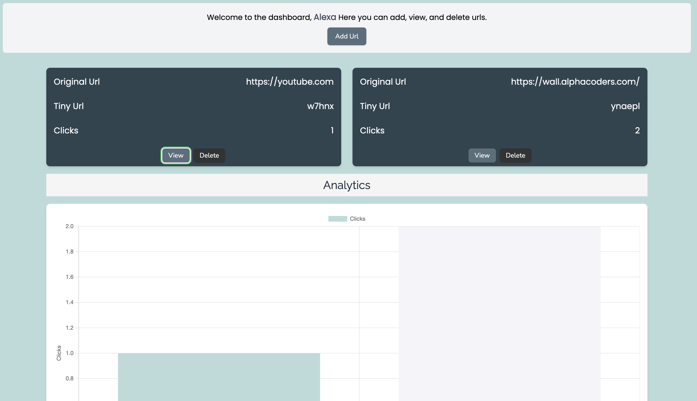
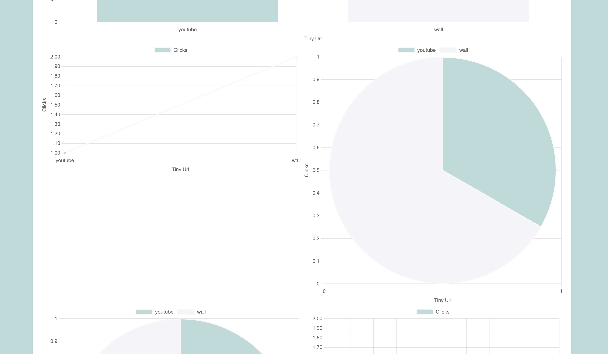
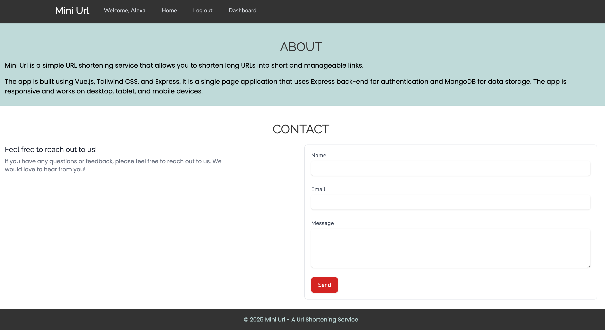
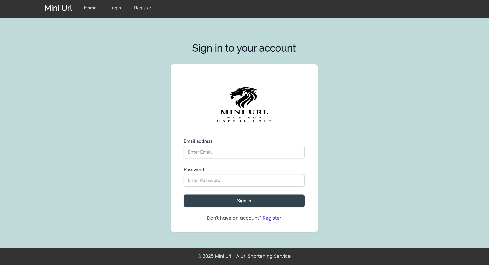

# MEVN URL Shortener with Authentication


This is a url shortener app for a MEVN stack application with authentication. This is for a SPA (Single Page Application) workflow that uses the [Vite](https://vite.dev) Build tool. This uses cookie based approach for authentication.

## What are URL shortner services?

URL shortener services are tools that take long URLs and convert them into shorter, more manageable links. These services are particularly useful for sharing links on social media, in emails, or in any context where space is limited. Shortened URLs are easier to remember, type, and share. Additionally, many URL shortener services provide analytics to track the number of clicks, geographic location of the clicks, and other useful data.

Popular URL shortener services include Bitly, TinyURL, and Google's now-defunct goo.gl. These services often offer additional features such as custom short links, link expiration, and password protection. URL shorteners can also help in branding by allowing businesses to create custom short domains that reflect their brand identity.

It includes the following:

- Backend API with Express & MongoDB
- Routes for auth, logout, register, profile, update profile
- JWT authentication stored in HTTP-only cookie
- Protected routes and endpoints
- Custom middleware to check JSON web token and store in cookie
- Custom error middleware
- Vue frontend to register, login, logout, view profile, and update profile
- Charts for the links visited using charts.js

## Screenshots

Please find some of the screenshots of the application. First 2 pages show the dashboard and the charts showing number of clicks.





Register page design



## Usage

- Create a MongoDB database and obtain your `MongoDB URI` - [MongoDB Atlas](https://www.mongodb.com/cloud/atlas/register)

### Env Variables

Rename the `.env.example` file to `.env` and add the following

```
NODE_ENV = development
PORT = 5000
MONGO_URI = your mongodb uri
JWT_SECRET = 'abc123'
```

Change the JWT_SECRET to what you want

### Install Dependencies (frontend & backend)

```
npm install
cd client
npm install
```

### Run

```

# Run frontend (:3000) & backend (:5000)
npm run dev

# Run backend only
npm run server
```

## Build & Deploy

```
# Create frontend prod build
cd frontend
npm run build
```

## Adding Cron Jobs

```
npm install node-cron
```

Write the script to show all the users of the database connected every minute and run this script inside tha server.js file every minute using node-cron.

```
// index.js (with ES modules)
import dotenv from 'dotenv';
import mongoose from 'mongoose';
import User from '../models/userModel.js'; // Import the User model

dotenv.config();

async function connectAndShowUsers() {
  try {
    await mongoose.connect("mongodb://localhost:27017/mevn_url_shortener");
    console.log('MongoDB Connected');

    // Fetch all users
    const users = await User.find({});
    console.log('Users:', users);

    // Optionally, process the users:
    if (users && users.length > 0) {
      users.forEach(user => {
        console.log(`Username: ${user.username}, Email: ${user.email}`);
      });
    } else {
        console.log("No users found");
    }

    // Close the connection (optional, but good practice):
    await mongoose.disconnect();
    console.log('MongoDB Disconnected');

  } catch (error) {
    console.error('Error:', error);
  }
}

connectAndShowUsers();

export default connectAndShowUsers;
```

Inside the server.js import and use it like this 

```
import cron from 'node-cron';
import connectAndShowUsers from './data/showUsers.js';

cron.schedule('* * * * *', () => {
  console.log('Running a task every minute');
  // This would connect to MongoDb and show all users every minute
  // connectAndShowUsers();
});
```
That's it, it should now display all user data every minute on console. This runs independently of the main node server. 

## Docker deployment

The application can be easily deployed using Docker containers. The application uses the following docker compose script to spawn 3 containers, one each for MongoDB, Express and Nginx

```
version: '3.8'
services:
  express:
    build:
      context: .
      dockerfile: Dockerfile
    container_name: express_miniurl
    ports:
      - 5000:5000
    depends_on:
      - mongo

  mongo:
    image: mongo
    container_name: mongo_miniurl
    restart: unless-stopped
    volumes:
      - ./mongo_data:/data/db
    ports:
      - '27017:27017'

  nginx:
    image: nginx
    container_name: nginx_miniurl
    restart: unless-stopped
    ports:
      - '80:80'
    volumes:
      - ./nginx/nginx.conf:/etc/nginx/nginx.conf
    depends_on:
      - express

volumes:
  mongo_data:
    external: true
```

Nginx is optional, we use it to proxy all requests coming to port 80 or 443 to port 5000. Using Nginx we can directly deploy the application on a server with Docker installed on it with one single magical command

```
docker-compose up
```

We use volumes for data persistance if the mongoDB containers are destroyed for some reason.

That's it for now, if you liked this project consider giving it a star ⭐